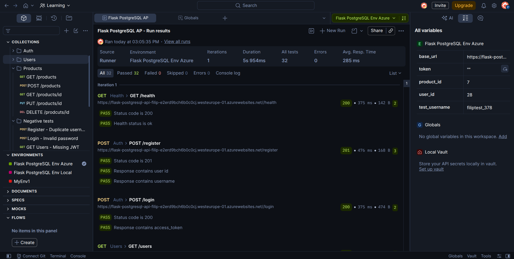
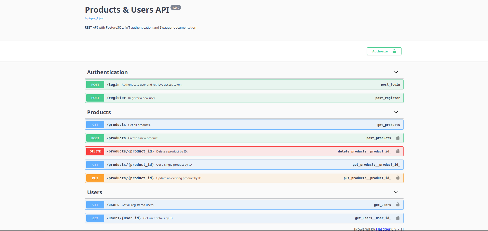

# Flask REST API – Products  & JWT Auth

Flask REST API with PostgreSQL, JWT Authentication and Swagger documentation

<br>**Live Demo:** [Application](https://flask-postgresql-api-filip-e2erd9bch6b0c0cj.westeurope-01.azurewebsites.net/)</br>
**Live Demo:** [Swagger UI](https://flask-postgresql-api-filip-e2erd9bch6b0c0cj.westeurope-01.azurewebsites.net/apidocs)

---

## Tech Stack & Architecture

* **Backend:** Python 3.12, Flask, psycopg (v3), Flask-JWT-Extended, standard logging
* **Database:** `PostgreSQL` locally / hosted on `Supabase`
* **API Docs:** Flasgger (`Swagger UI at` `/apidocs`)
* **Deployment & CI/CD:** `Azure App Service (Linux)`, `GitHub Actions`
* **Testing:** `Postman` (environments, automated test scripts, JWT token handling, dynamic test data)

---

## Key Features

* **Authentication & Security:** User registration and authentication (`POST /register`, `POST /login`), secure password hashing, and Bearer JWT token protection for restricted endpoints.
* **Request Validation & Error Handling:** Backend payload validation to handle missing required fields, non-JSON bodies, and invalid price formats (e.g. negative numbers) with structured JSON error responses and standard HTTP status codes (`400 Bad Request`, `401 Unauthorized`, `404 Not Found`).
* **Database Management:** PostgreSQL database connection via `psycopg3`.
* **Logging & Observability:** Configured Python `logging` module to track system events, database errors, and failed login attempts.
* **Testing & Automation:** Comprehensive Postman collection with automated test scripts covering positive and negative test scenarios, including duplicate registration, invalid credentials, and missing JWT tokens.

---

## Endpoints

| Method | Endpoint | Auth | Description |
| :--- | :--- | :--: | :--- |
| **GET** | `/apidocs` | No | Interactive Swagger UI documentation |
| **GET** | `/health` | No | Application health check |
| **POST** | `/register` | No | Register a new user |
| **POST** | `/login` | No | Authenticate user and issue JWT token |
| **GET** | `/users` | JWT | Retrieve all users |
| **GET** | `/users/<id>` | JWT | Retrieve specific user details by ID |
| **GET** | `/products` | No | Retrieve list of products |
| **GET** | `/products/<id>` | No | Retrieve specific product details by ID |
| **POST** | `/products` | JWT | Create a new product |
| **PUT** | `/products/<id>` | JWT | Update an existing product |
| **DELETE** | `/products/<id>` | JWT | Delete a product by ID |

---

## API Testing with Postman

The API was tested using Postman with automated test scripts and environment variables.

The collection uses separate Postman environments for local and deployed API testing, with variables for the base URL, JWT token, and dynamic test data.

The test collection covers:

- User registration and authentication with JWT
- Automatic generation and reuse of dynamic `test_username`, `user_id` and `product_id` values
- Automatic capture and reuse of JWT tokens
- Positive and negative test scenarios
- HTTP status code and response validation
- Protected endpoints with and without JWT authentication
- Duplicate user registration
- Invalid login credentials
- Product CRUD operations
- Missing and invalid request data


The Postman collection is designed to be repeatable, with test scripts handling authentication and dynamic test data automatically.


## Screenshots

### Automated Test Suite Results (Postman)


### Swagger UI Documentation (`/apidocs`)


---

## Environment Variables

Required variables in the `.env` file (locally) and under *Environment variables* in Azure App Service:

```env
DB_HOST=your_host
DB_NAME=postgres
DB_USER=your_db_user
DB_PASSWORD=your_db_password
DB_PORT=5432
JWT_SECRET_KEY=your_secret_key
```

## Quickstart (Local)

1. **Clone the repository:**
```bash
git clone https://github.com/filipsarnecki/flask-postgresql-api.git
cd <YOUR_REPOSITORY_FOLDER>
```


2. **Install dependencies:**
 ```bash 
pip install -r requirements.txt
```

Create a **.env** file in the root directory following the **Environment Variables** section above.

3. **Run the server:**
```bash
python app.py
```

## Deployment Challenges & Solutions

### Database Deployment
During deployment, the direct PostgreSQL connection to Supabase failed because Azure App Service could not establish the required `IPv6` connection. Switching to the `Supabase Session Pooler with IPv4` support resolved the connectivity issue.

### CI/CD
Enabled Azure App Service > `Configuration > General Settings > SCM Basic Authorization` to allow downloading the `Publish Profile`, then customized the Azure-generated GitHub Actions workflow template for the project. Added the Publish Profile as a `GitHub Actions secret` > `Settings > Secrets and Variables > Actions > New repository secret` and configured the workflow once again to deploy the application automatically after pushes to `main`.

## What I Learned

During this project I gained hands-on experience with:

- Designing simple product REST APIs using `Flask`
- Testing API in Postman including fundametals of scripting
- Basics of PostgreSQL / Supabase platform
- JWT authentication
- Password hashing
- Environment configuration
- Implementing backend request validation and handling HTTP status codes
- Basics of GitHub Actions for CI/CD
- Deploying applications to Azure App Service / Basics of Log Stream
- Basic deployment troubleshooting